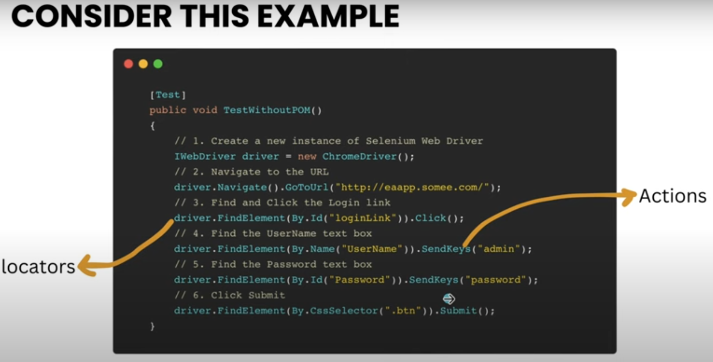

### Page Object Model [POM]

1. Page Object is a **Design Pattern** that has become popular in test
automation for enhancing test maintenance and reducing code
duplication.

2. POM has other advantages such as
	1. If the UI changes, only the page object code needs updating, not the
tests.
	2. Changes in UI or locator of the app can easily be made in one place
	3. Distinct division between test code and page-specific code
	4. All services or operations offered by the page are housed in a single
repository, avoiding scattering across various tests.

